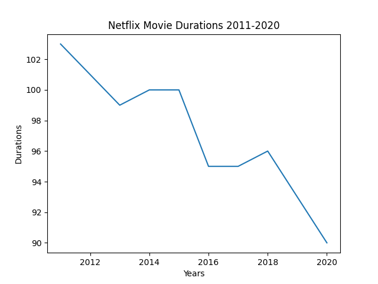

# netflix-and-guest-stars-in-office

In this project, I will solve a real-world data science problem. 
I will use everything from lists and loops to pandas and matplotlib to discover if Netflix's movies are getting shorter over time 
and which guest stars appear in the most popular episode of "The Office"

## 📺 Netflix's movies are getting shorter over time?

It looks like there is something to the idea that movie lengths have decreased over the past ten years!!!

What if we have a close look on only type "Movies" on Netflix? A line plot is no longer a good choice for our data, so let's try a scatter plot instead

We can also see that, while newer movies are overrepresented on the platform, many short movies have been released in the past two decades.
Upon further inspection, something else is going on. Some of these films are under an hour long! Let's filter our DataFrame for movies with a duration under 60 minutes and look at the genres. This might give us some insight into what is dragging down the average.
- 🔴 genre "Children"
- 🔵 genre "Documentaries" 
- 🟢 genre "Stand-up"
- ⚫ others

After performing an exploratory analysis, the **question** is that "Are movies getting shorter?"

Well, as we suspected, non-typical genres such as children's movies and documentaries are all clustered around the bottom half of the plot. But we can't know for certain until we perform additional analyses. Now the **answer** is "no" or "maybe"

